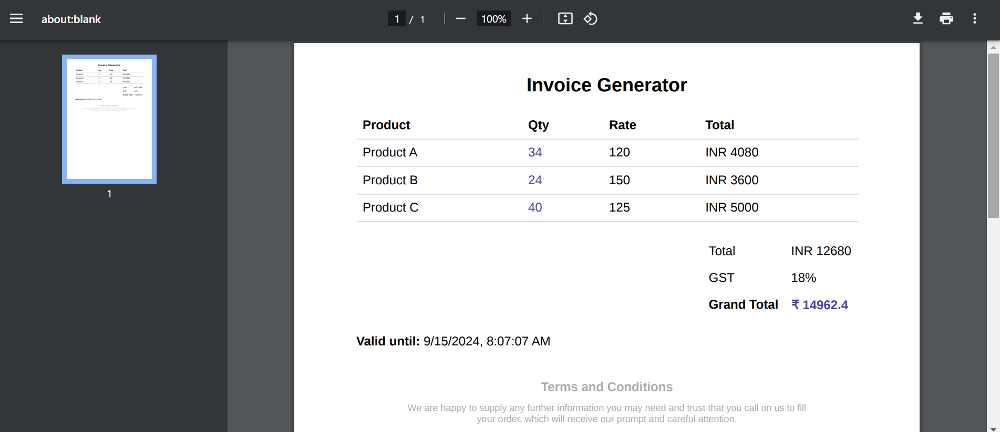

# Invoice Generator

A Node.js application for generating and managing invoices, built with TypeScript and Docker. The application uses Puppeteer for PDF generation and is deployed using Render.

- [Features](#features)
- [Technologies Used](#technologies-used)
- [Project Structure](#project-structure)
- [Setup and Installation](#setup-and-installation)
- [Testing the API](#testing-the-api)
- [Docker Setup](#docker-setup)
- [Deployment Process](#deployment-process)
- [Troubleshooting](#troubleshooting)

## Features

- Generate invoices in PDF format.
- Store and manage invoices.
- Secure access with authentication.
- Easy deployment with Docker and Render.

## Technologies Used

- **Node.js**: JavaScript runtime for building the backend.
- **TypeScript**: Superset of JavaScript for static type-checking.
- **Puppeteer**: Library for generating PDFs.
- **Express**: Web framework for Node.js.
- **MongoDB**: NoSQL database for storing invoices.
- **Yup**: Request validation and error handling for application.
- **Docker**: Containerization for consistent environments.
- **Render**: Platform for deploying Docker containers for web service.

## Project Structure

```plaintext
invoice-generator/
├── src
│   ├── controllers
│   │   ├── auth-controller.ts
│   │   ├── product-controller.ts
│   │   └── quote-controller.ts
│   ├── middleware
│   │   ├── auth-middleware.ts
│   │   └── validate.ts
│   ├── models
│   │   ├── product-model.ts
│   │   ├── quotation-model.ts
│   │   └── user-model.ts
│   ├── routes
│   │   ├── auth-route.ts
│   │   ├── product-route.ts
│   │   └── quote-route.ts
│   ├── utils
│   │   └── generatePDF.ts
│   └── app.ts
├── .dockerignore
├── .env
├── .gitignore
├── Dockerfile
├── License
├── nodemon.json
├── package.json
├── pnpm-lock.yaml
├── README.md
└── tsconfig.json

```

## Setup and Installation

### Prerequisites

- Node.js (version 18 or later)
- Docker
- pnpm (package manager)

1. **Clone the repository:**

   ```bash
   git clone https://github.com/gulshanb098/invoice-generator.git
   cd invoice-generator
   ```

2. **Install Dependencies:**

   ```bash
   pnpm install
   ```

3. **Create .env file in root directory and add these environment variables:**

   ```bash
   PORT=5000
   JWT_SECRET=<your_jwt_secret>
   MONGO_URI=<your_mongo_uri>
   ```

4. **Build the Project:**
   ```bash
   pnpm run build
   ```
5. **Run Locally:**
   ```bash
   pnpm run dev
   ```

## Testing the API

**_NOTE: Postman Collection is in public folder_**

1. **User Registration:**

   ```curl
   curl --location 'http://localhost:5000/api/auth/registration' \
    --header 'Content-Type: application/json' \
    --data-raw '{
    "name": "Gulshan Baraik",
    "email": "gulshan.baraik@example.com",
    "password": "password123"
    }'
   ```

2. **User Login:**

   ```curl
   curl --location 'http://localhost:5000/api/auth/login' \
    --header 'Content-Type: application/json' \
    --data-raw '{
    "email": "anand.patel@example.com",
    "password": "password123"
    }'
   ```

3. **Add Products & Generate Invoice PDF:**

   ```curl
   curl --location 'http://localhost:5000/api/product/addProducts' \
    --header 'Content-Type: application/json' \
    --header 'Authorization: Bearer <user_jwt_token>' \
    --data '{
    "products": [
        {
        "name": "Product A",
        "qty": 34,
        "rate": 120
        },
        {
        "name": "Product B",
        "qty": 24,
        "rate": 150
        },
        {
        "name": "Product C",
        "qty": 40,
        "rate": 125
        }
    ]
    }'
   ```

4. **Get All Invoices of User & PDF Link to Download:**
   ```curl
   curl --location 'http://localhost:5000/api/quote/allInvoices' \
    --header 'Authorization: Bearer <user_jwt_token>'
   ```
   **NOTE: Copy downloadLink and paste in browser, and hit ender, it will generate PDF**

## Docker Setup

1. **Build Docker Image:**
   ```bash
   docker build -t invoice-generator .
   ```
2. **Run Docker Container:**
   ```bash
   docker run --env-file .env -p 5000:5000 invoice-generator
   ```
   **NOTE: Ensure that .env file is correctly configured with the necessary environment variables.**

## Deployment Process

1. **Push Docker Image to Docker Hub:**
   ```bash
   docker tag invoice-generator <your-dockerhub-username>/invoice-generator
   docker push <your-dockerhub-username>/invoice-generator
   ```
2. **Deploy on Render:**

- Login in Render account.
- Create a new web service.
- Select Docker as deployment method.
- Set the Docker image url like `your-dockerhub-username/invoice-generator`
- Add necessary environment variables in configuration.
- Click `Create Web Service` and Render will pull the Docker image from Docker Hub and deploy it.



## Troubleshooting

- **Puppeteer Errors**: Ensure that the --no-sandbox and --disable-setuid-sandbox flags are set in the Puppeteer launch configuration with executablePath. Also docker image should install all required packages like chromium, libnss3 etc.
  ```typescript
  const browser = await puppeteer.launch({
    args: ["--no-sandbox", "--disable-setuid-sandbox"],
    executablePath: "/usr/bin/chromium",
  });
  ```
- **MongoDB Connection Issues**: Verify the connection string and network accessibility.

## Thank You! ❤️
